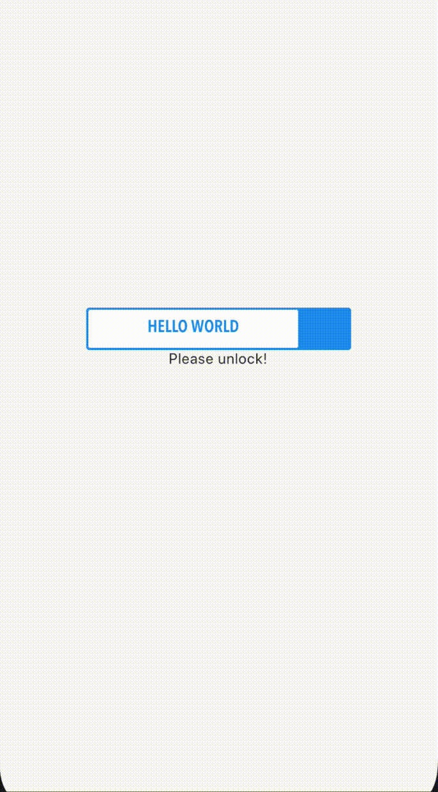

# slide_animated_password_lock

A simple password input field with slide lock animation.


## Parameters
`password` - Correct password value to trigger the sliding animation 

`controller` - Text Editing Controller for textfield

`color` - Color of the input field

`width` - (Optional) the total width of the widget. Default to 250, require > 0

`height` - (Optional) the height of the widget. Default to 40, require > 0

`placeholder` - (Optional) placeholder in the textfield. Default to an empty string. 


## Getting Started
Add the plugin:
```
    dependencies:
        slide_animated_password_lock: ^1.0.0
```


## Basic Usage

```
 SlideAnimatedPasswordLock(
  password: _password,
  controller: _textFieldController,
  color: Theme.of(context).primaryColor,
  placeholder: "HELLO WORLD",
  onUnlock: (_unlocked){
    if (_unlocked){
      setState(()=>_msg = "Unlocked!");
    }else{
      setState(()=>_msg = "Please unlock!");
    }
  },
)
```
